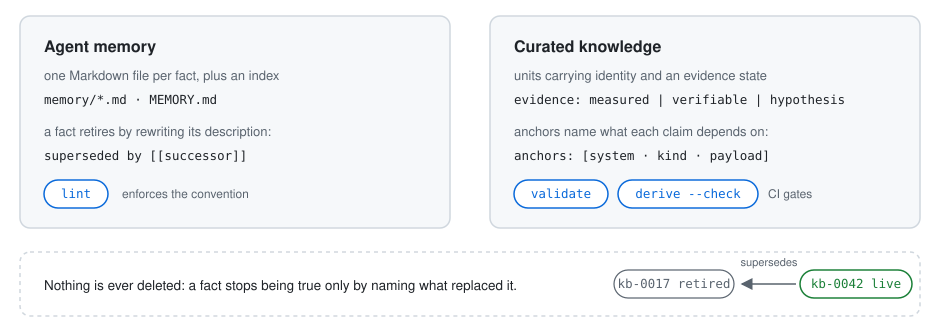
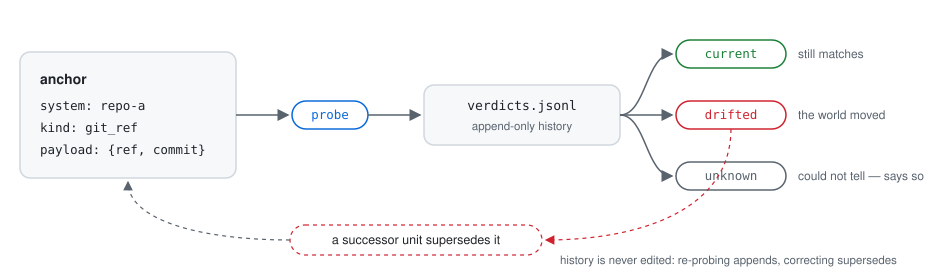
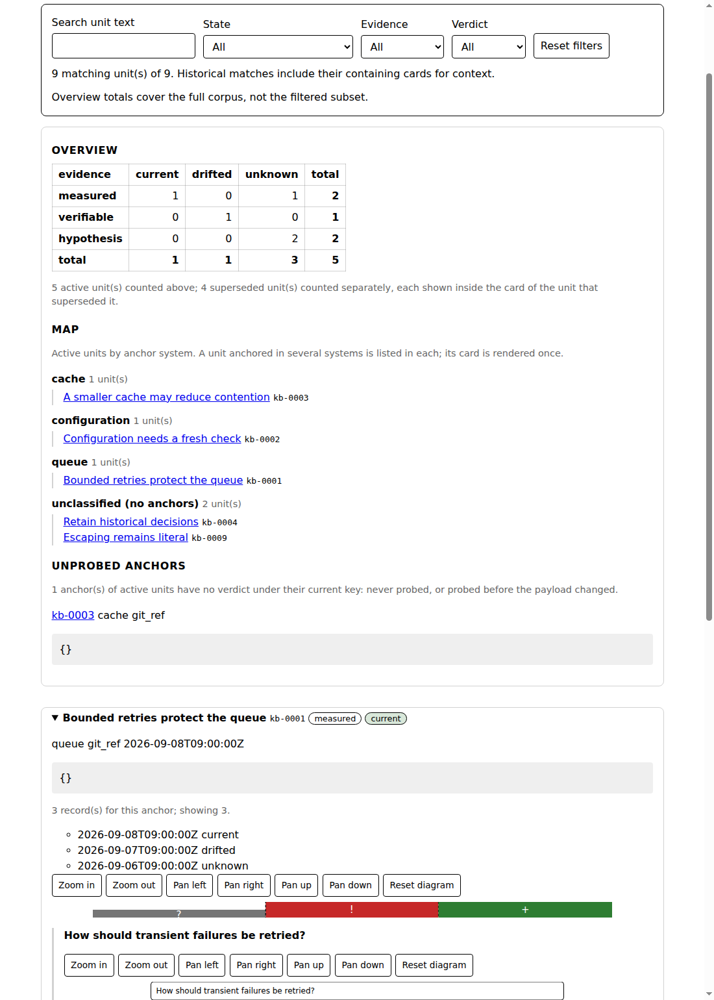

# validated-memory

[](https://github.com/everywan-dev/validated-memory/actions/workflows/ci.yml)
[](LICENSE)

Validated memory for agent projects: evidence states, supersession without
deletion, freshness probes with a ternary verdict.

[Installing](#installing) · [Quickstart](#quickstart) ·
[CLI](#the-cli-at-a-glance) · [Skills](#skills) · [Documentation](#documentation)

**Agent memory rots silently.** An agent writes down a fact in March; by June
the world has moved on, and nothing tells you. Recall is a crowded
competition; whether what is recalled is *still true* is the neglected half
of the problem.

validated-memory makes knowledge expiry the first-class problem. Every fact
states how it is known (`measured | verifiable | hypothesis`) and what it
depends on — re-checkable anchors — and freshness probes answer with a
ternary verdict, `current | drifted | unknown`, that says "could not tell"
rather than guess. A verdict means *as of the last probe you ran*: probing is
an explicit act you schedule, not background magic. Nothing is ever deleted:
a fact stops being true only by naming what replaced it. A false "still
true" is the one answer this tool must never give.

<picture>
  <source media="(prefers-color-scheme: dark)" srcset="docs/assets/model-dark.svg">
  <source media="(prefers-color-scheme: light)" srcset="docs/assets/model-light.svg">
  
</picture>

Two layers, one discipline. **Agent memory** — one Markdown file per fact
plus an index, versioned in the adopter repo; the harness reads it through a
symlink the plugin maintains ([reference](docs/reference/agent-memory.md)).
**Curated knowledge** — units carrying identity, an evidence state, and
anchors separated from provenance
([reference](docs/reference/curated-knowledge.md)). Adopter projects hold
only Markdown data and configuration; all code stays in the plugin, so a fix
reaches every adopter that updates.

- **Enforced, not promised** — `validate`, `lint` and `derive --check` are
  CI gates; drift from the contract fails the build.
- **No third-party dependencies** — Python standard library only, and the
  data is plain Markdown, readable without the plugin installed.
- **Easy exit** — abandon the tool and you keep ordinary Markdown files.

## Installing

Two commands inside Claude Code:

```
/plugin marketplace add everywan-dev/validated-memory
/plugin install validated-memory@validated-memory
```

Two things to know before you run them. **Installing activates two
`SessionStart` hooks** — fail-open no-ops until a project adopts the method,
after which one maintains the harness-memory symlink (on first adoption it
may absorb the harness's existing memory directory, parking the original as
a `.bak`) and the other refreshes any activated HTML views; what each writes
is documented in [Startup hooks](docs/reference/hooks.md). And **updating is
not automatic**: the plugin is pinned to its declared version, and picking up
a fix means running `/plugin marketplace update validated-memory` (or
enabling auto-update for this marketplace once).

Other Git hosts, team-wide installs, and running the CLI without Claude
Code — in CI, or from a shell — are covered in
**[Installing](docs/installing.md)**.

## Quickstart

From an empty directory (`python3 -m validated_memory` must be importable —
see [Installing](docs/installing.md#running-the-cli-outside-the-plugin)):

```console
$ python3 -m validated_memory init
init: created knowledge
init: created memory
init: created memory/MEMORY.md
init: created validated-memory.md
init: created knowledge-extension.md
init: 5 created, 0 kept, 0 error(s), 0 warning(s)

$ cat > knowledge/kb-0001.md   # one fact: id, evidence, an anchor to re-check

$ python3 -m validated_memory validate
validate: 1 unit(s) checked, 0 error(s), 0 warning(s)

$ python3 -m validated_memory probe
probe: 1 anchor(s) probed across 1 unit(s): 1 current, 0 drifted, 0 unknown

$ python3 -m validated_memory derive
derive: 1 unit(s) indexed
```

The derived index now grades every unit by the worst verdict among its
anchors:

```markdown
| id      | state  | evidence | verdict |
|---------|--------|----------|---------|
| kb-0001 | active | measured | current |
```

The **[walkthrough](docs/walkthrough.md)** runs the full cycle — including
drift and supersession — with real file contents; the
**[adoption guide](docs/adoption.md)** is the checklist for wiring a real
project, CI gate included.

## The CLI at a glance

| Command | What it does |
|---------|--------------|
| [`init`](docs/reference/cli.md#init) | Scaffold an adopter project; wire the harness-memory symlink; activate views |
| [`lint`](docs/reference/cli.md#lint) | Enforce the agent-memory layer: index sync, frontmatter, wikilinks, supersession |
| [`validate`](docs/reference/cli.md#validate) | Enforce the base contract plus the adopter's declared extension |
| [`derive`](docs/reference/cli.md#derive) | Re-derive the knowledge index; `--check` gates CI against drift |
| [`probe`](docs/reference/cli.md#probe) | Run freshness probes; append ternary verdicts to the log |
| [`render`](docs/reference/cli.md#render) | Write self-contained, inert HTML views of both layers |

Exit codes: `0` = clean or WARNING-only findings; `1` = ERROR (gates);
`2` = usage error. Full contracts in the
**[CLI reference](docs/reference/cli.md)**.

Freshness is a loop, not a flag:

<picture>
  <source media="(prefers-color-scheme: dark)" srcset="docs/assets/lifecycle-dark.svg">
  <source media="(prefers-color-scheme: light)" srcset="docs/assets/lifecycle-light.svg">
  
</picture>

A `drifted` or `unknown` verdict is data, not a failure: `probe` never gates
on what it finds, and the index reports it so a person — or an agent — can
answer drift by writing a successor unit.

## The views

`render` writes two self-contained HTML pages — no JavaScript, no network —
showing live conclusions, each anchor's probe history as a freshness strip,
and the supersession chain that led to every fact:



See [`render`](docs/reference/cli.md#render) for both pages' contracts, and
[Startup hooks](docs/reference/hooks.md) for how the views stay fresh across
sessions once activated.

## Skills

Five skills make the method invocable from an agent session, each naming the
exact CLI invocation and the data discipline to follow — never reimplementing
a rule the CLI already enforces:

- **`adopt-validated-memory`** — bootstrap a project, wire the symlink,
  verify with `validate` and `lint`.
- **`create-knowledge-unit`** — write a unit field by field, with the
  evidence-state discipline.
- **`supersede-knowledge`** — correct knowledge with a successor, never by
  editing the superseded unit.
- **`probe-freshness`** — probe, re-derive, read the ternary verdict.
- **`maintain-agent-memory`** — record or supersede a memory fact, verify
  with `lint`.

## Requirements and compatibility

- **Version 1.1.1** — the v1 surface is complete: all six subcommands, five
  skills, two startup hooks, static HTML views.
- **Python ≥ 3.9**, standard library only; pytest is the only development
  dependency.
- **Claude Code** to run it as a plugin; the CLI stands alone everywhere
  else (CI, shell).
- **Git on `PATH`** for the bundled `git_ref` probe; no other probe needs it.
- Updates are version-pinned — see
  [Updating](docs/installing.md#updating).

## Documentation

| | |
|---|---|
| **[Installing](docs/installing.md)** | Hosts, updating, team installs, CLI without Claude Code |
| **[Adoption guide](docs/adoption.md)** | The checklist for a real project, CI gate included |
| **[Walkthrough](docs/walkthrough.md)** | Every layer end to end, with real file contents |
| **[CLI reference](docs/reference/cli.md)** | The full contract of each subcommand |
| **[Curated knowledge](docs/reference/curated-knowledge.md)** | Base contract, adopter configuration, declared extension |
| **[Agent memory](docs/reference/agent-memory.md)** | The memory layer's rules, identity, and supersession |
| **[Startup hooks](docs/reference/hooks.md)** | What runs at session start, and what it writes |
| **[ADRs](docs/adr)** | Decisions of record |

## Development

Runtime code is Python 3, standard library only.

```
python3 -m pytest
```

Tests are end-to-end only: they invoke the CLI as a subprocess over fixture
adopter trees and assert on exit codes, output, and produced files. Tests
never import the package's internals. Contributions follow
[CONTRIBUTING.md](CONTRIBUTING.md); bugs and questions go to
[issues](https://github.com/everywan-dev/validated-memory/issues).

Licensed under [Apache-2.0](LICENSE).
