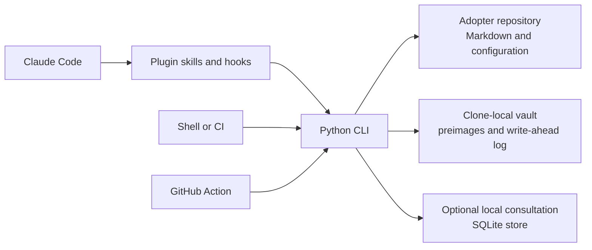

# Architecture

This page describes the components and data boundaries in the published
release. The plugin provides agent workflows and hooks; one Python CLI owns
validation and file operations. An adopter stores its knowledge as ordinary
Markdown and configuration in its repository.

The diagram in words: Claude Code loads the plugin's skills and hooks, which
invoke the Python CLI. A shell, CI job or the GitHub Action can invoke the same
CLI independently. The CLI reads or writes the adopter repository; `init` also
uses a clone-local vault for recovery data. Checked consultation uses a
separately chosen local SQLite store only when that workflow is explicitly
invoked.

## Components

- **Plugin distribution:** `.claude-plugin/` describes the marketplace and
  plugin. The plugin includes skills plus three fail-open `SessionStart` hooks
  and an opt-in `UserPromptSubmit` hook. The hooks call the packaged CLI; they
  do not implement validation rules themselves. See [startup hooks](reference/hooks.md).
- **Python package and CLI:** `python3 -P -m validated_memory` is the supported
  entry point. Runtime code uses the Python standard library. The CLI can run
  under Claude Code, from a shell, in CI, or through the reusable GitHub Action.
- **Adopter repository:** `knowledge/` and `memory/` contain Markdown records.
  Configuration declares the curated-knowledge extension and probes. The
  derived knowledge index and HTML views can be rebuilt; the verdict log and
  adoption journal retain their documented histories.
- **Clone-local vault:** `.validated-memory/` is ignored local state used for
  preimages and open journal transactions. The harness-memory path can be a
  symlink into the adopter's `memory/` directory.
- **Optional consultation store:** checked consultation uses a separately
  selected SQLite file outside adopter roots. It is not initialized by normal
  validation, recall, rendering or prompt discovery.

## Boundaries

`lint` checks agent-memory structure; `validate` checks curated-knowledge
contracts; `derive` rebuilds the knowledge index; and `probe` records the
result of checking declared anchors. A `current` anchor verdict describes the
probe result, not semantic truth or suitability for a task. `recall` discovers
possible records but does not validate them. Human or attributed agent review
still decides applicability and meaning.

Canonical `knowledge.html` and `memory.html` are self-contained, script-free
views. `knowledge-app.html` is a separately activated enhancement with one
repository-owned inline script; it uses no network or third-party runtime code.
See [the view contract](reference/cli.md#render) and
[ADR 0013](adr/0013-canonical-views-are-inert-and-the-app-is-opt-in.md).
